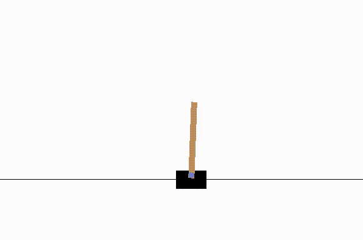
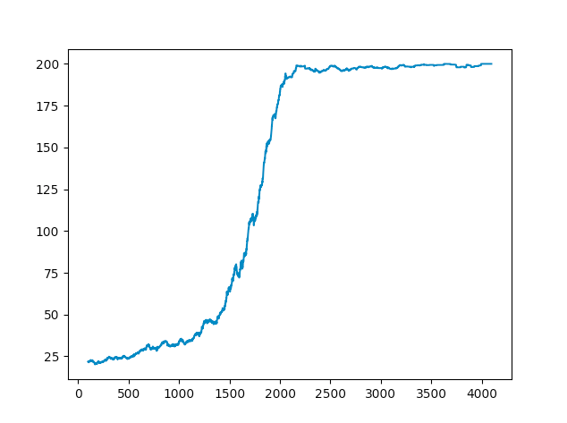

# CartPole
A neural agent which solves the CartPole-v0 Classic Control problems on the OpenAI Gym.

See it play the CartPole game here:




## Installation

- Fork or clone this repository
- Install all the dependencies by running
```sh
pip install requirements.txt
```
- Optionally, see how an agent behaving randomly behaves by running `python random_play.py`.
- Train the neural network by running `python main.py` from the root of the repo. You can then see the graph of its learning and see the agent perform the CartPole task

## Performance

### Architecture

The network has two fully-connected layers of 256 nodes each with a 10% chance of dropout. The default training period is for 4096 attempts using AdamOptimizer with a learning rate of 0.0001. The loss function is just mean squared error.

### Outcomes

OpenAI defines 'solving' the problem as achieving an average of over 195 for 100 consecutive trials. This solution achieves this, but is certainly not the fastest way to do so. The learning takes around 40 minutes to run on my mac.

Here we can see the agent's 100-trial moving average performance over its training period. Note that 200 is the maximum score it can achieve. The axes are training session vs score.



### Improvements to be made

Since the game only lasts for 200 steps, the agent tends to move slowly to the right or the left rather than balancing the pole directly above itself. This strategy passes the test but doesn't equip it for long term survival (say if the environment went to 2000 rather than 200). Solving this could be as simple as changing its reward function to include a penalty for moving from the centre.

Also, changes in neural network architecture could improve it's speed, and I would be very happy to receive a pull request with suggestions.
